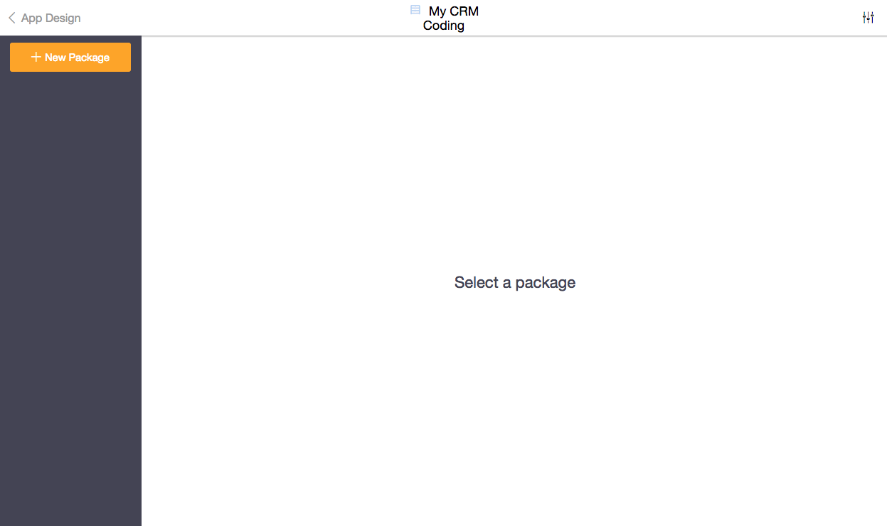
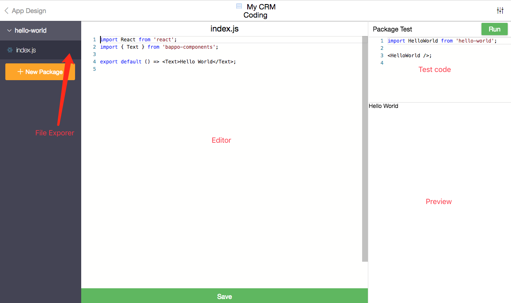

This page will show you how to create a custom view and embed it in a page.

## Open the Coding Tool

Click on `Coding` in Advanced Design to open the coding tool.

## Create your first Code Package

Click on `New Package` and enter `hello-world` as the Package name. Leave
Package type as `View` since we are creating a View.

## React

If you can recognize what the code is doing, that's great! This is the React
that you are familiar with.

But don't panic if you don't know React. React is a JavaScript library that lets
you build user interfaces in a declarative manner.
[Learn some React](https://reactjs.org/docs/hello-world.html) and come back!

## Live Reloading

Try to change the text `Hello World` to `Hello {{Your Name}}` and click `Save`.
You can see the preview on the right-hand side refreshing immediately. This will
help you speed up development.

## Embed in a Page

Go back to Advanced Design. Create a new Page called `Hello World` and create a
Menu Item that links to the new Page.

Create a new Tab in the Hello World Page. Set title to `Hello World` and select
the `hello-world` package as View.

Click on `Go to this App` to exit Design. You should see the Menu Item `Hello
World`. Open the link and you will see your custom view rendered in the page.
