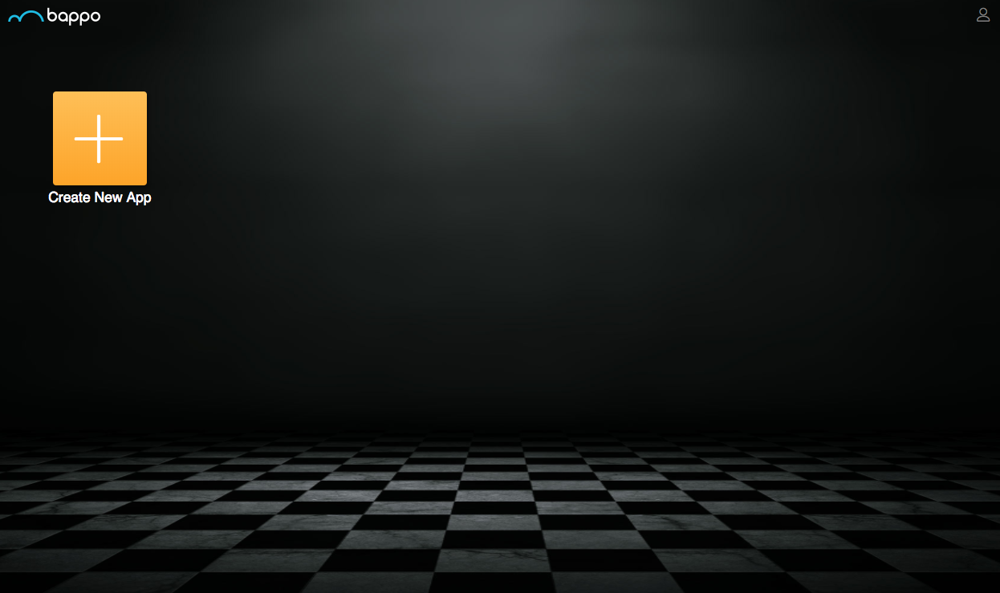
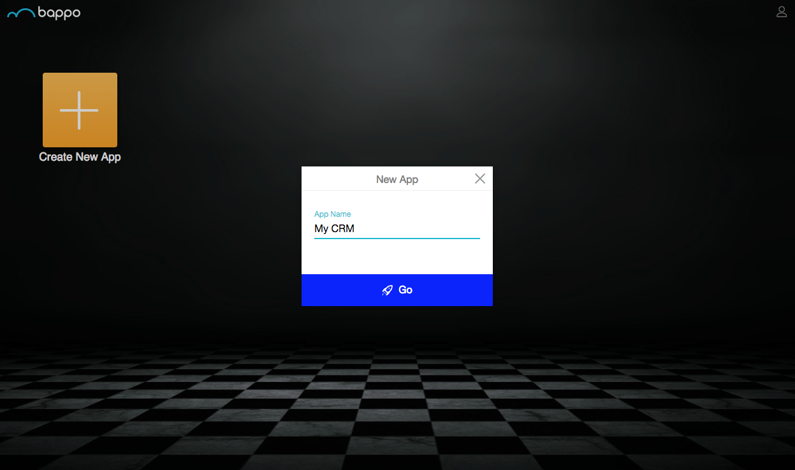

This page will help you create your first online database App with built-in chat
functionality on Bappo.

## Create an account

Go to [Bappo](go.bappo.com) and sign up. Once you've registered and verified
your email, log in and you will see the screen below:

## Create your first App

Click on `Create New App` and enter your App name.

Click `Go` and your App will be ready instantly!
